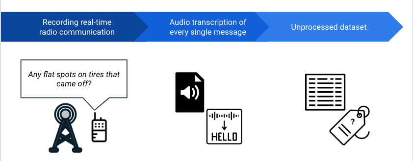
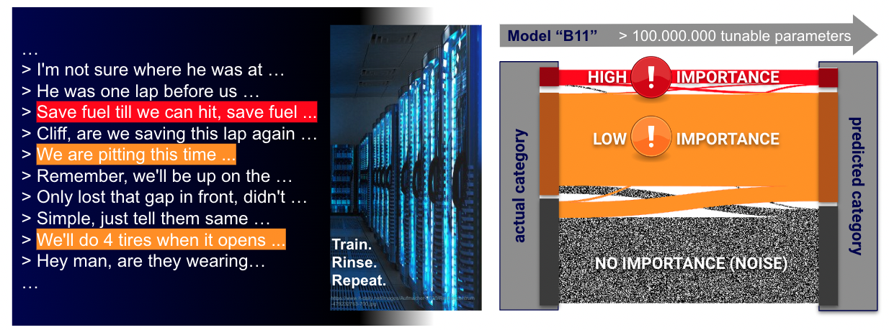
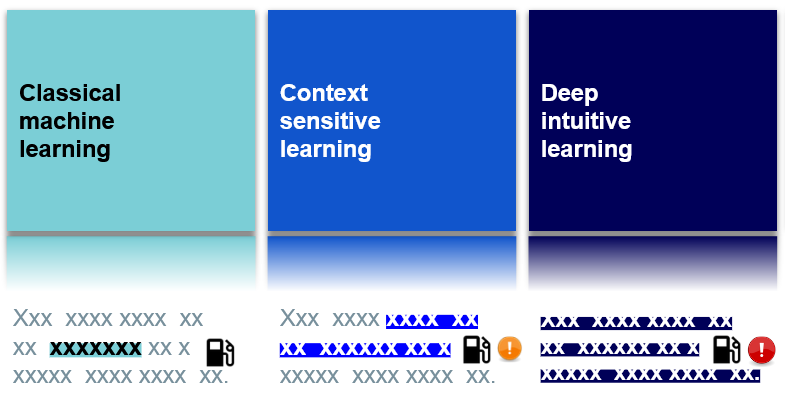

# Rolos 

## Project Introduction
   Rolos aims to help scientists increase productivity and achieve exponential progress in research projects by leveraging the power of big data to address researchers' most common pain points and provide them with access to advanced technologies. The company's customer, NASCAR, has 45 radio channels for communication between drivers and engineers. However, monitoring all the channels is a resource-consuming task. Thus, an automated real-time radio analytics service is needed to provide better insight.

## Project Description

We set out to classify text messages and identify key messages in the radio communications of auto racing teams. Their system's goal is to help engineers focus on high-priority messages by distinguishing important information from noise.

Rolos' and the students' approach involves recording real-time radio communications, audio transcription of every single message, and using NLP machine and deep learning techniques to classify and identify key messages. The result is a highly efficient system that ensures engineers focus only on the essential messages that can affect the race. This system can correctly identify 93% of the messages as high or low importance. 75% Of all high importance messages were identified! See the picture below.

## Conclusion
   The benefits of this system are numerous. It increases safety by analyzing real-time messages, provides high performance in classifying fast random inputs, and reduces labor costs. The system provides more accurate information to race teams, enabling them to make informed decisions that can improve their performance.
   

## Outlook
Future plans include collecting human feedback on the data, implementing a live scenario for real-time optimization, and collecting more learnable data to improve the system's accuracy.

Why our project might be important to them and general background
https://www.science.org/content/article/science-fast-track

https://motorsportexplained.com/role-of-the-race-engineer/

https://auto.howstuffworks.com/auto-racing/nascar/jobs/nascar-driver-communicate.htm